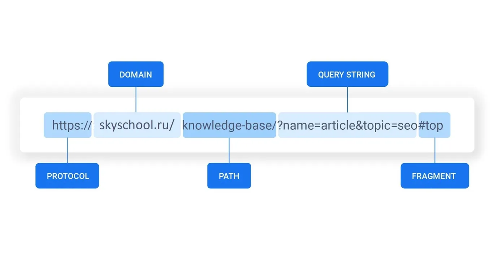

## HTTP (Hyper Text Transfer Protocol)

Самым распространенным протоколом на сегодняшний день является  HTTP (HyperText Transfer Protocol), что расшифровывается как «протокол передачи гипертекста».

Он включает в себя следующие понятия:

- URL,
- методы,
- заголовки,
- статусы ответов,
- тело запроса или ответа.

📝 URL — это лишь адрес, который выдан уникальному ресурсу в интернете. Каждый корректный URL ведет на уникальный ресурс. Такими ресурсами могут быть HTML-страница, CSS-файл, изображение и т. д.

Если коротко, то URL — это строка, которую вы вводите в браузере для получения доступа к какому-либо ресурсу (веб-приложению).

  

URL состоит из **протокола (protocol)** HTTP или HTTPS (окончание S означает Security, т. е. данные будут передаваться в зашифрованном виде). Далее следует **домен (domain)** — это сам адрес сайта. **Путь (path)** помогает производить навигацию по сайту, с его помощью мы можем указать, какую страницу мы все-таки хотим получить. В конце всегда находятся **параметры (query string и fragment)** — дополнительная информация в виде пары ключа и значения, которую мы хотим сообщить веб-приложению.

😮 На самом деле, когда мы вводим URL в виде букв человеческого алфавита, браузер идет к DNS-серверу (Domain Name System — система доменных имен). DNS используется для получения IP-адреса по URL.

Другими словами, DNS хранит в себе информацию о том, какому URL-адресу соответствует какой IP-адрес. С помощью DNS браузер получит IP-адрес машины с искомым ресурсом.  

### Методы

**Метод HTTP** — это короткое слово на английском, которое указывает, что конкретно нужно сделать с запрашиваемым ресурсом. Их порядка десяти, но наиболее популярными являются следующие:  
**GET** — для получения данных с сервера.  
**POST** — для отправки данных на сервер.  
**PUT** — для редактирования данных.  
**DELETE** — для удаления данных.  

### Заголовки
Заголовки — это специальные параметры, которые несут определенную служебную информацию о соединении по HTTP. Некоторые заголовки имеют лишь информационный характер для пользователя или для компьютера, другие передают определенные команды, исходя из которых сервер или клиент будет выполнять какие-либо действия.

Примером, иллюстрирующим работу заголовка, в реальной жизни может быть инструкция по применению на упаковке шампуня. Это необязательный контент, но тем не менее он указан.

Или при покупке какого-либо продукта, например соуса или сыра, на упаковке есть рецепт приготовления. Его необязательно использовать, так как основной контент — это продукты, но это дополнительная помощь к применению.

### Структура ответов
Ответ от веб-приложения также может иметь заголовки. Но помимо них, в нем есть код ответа. По коду ответа вы можете определить, какие действия вам предпринимать дальше.

Можно выделить пять групп кодов ответов. Каждая группа соответствует первой цифре, например:

1хх — информационные коды. Означает, что сервер получил начальную часть запроса и готов принять остальную его часть.

2хх — указывает на то, что запрос выполнен успешно.

3хх — перенаправление производится не на новый (только что загруженный) ресурс, а на другую страницу, например страницу подтверждения или страницу с результатами загрузки.

4хх — говорит об ошибке на стороне клиента.

5хх — сервер столкнулся с неожиданной ошибкой, которая помешала ему выполнить запрос.
Наиболее часто используются следующий статусы ответа:

200 — всё хорошо, запрос выполнился.

400 — есть ошибка в параметрах запроса.

404 — URL неверный или такого действия нет в веб-приложении.

500 — во время выполнения запроса произошла ошибка на сервере.

Еще в ответе (как и в запросе) может присутствовать тело. В протоколе HTTP для передачи большого количества данных используется метод POST. Главное его отличие от метода GET в том, что он содержит так называемое «тело запроса», т. е. место, в котором можно передавать файлы или данные.