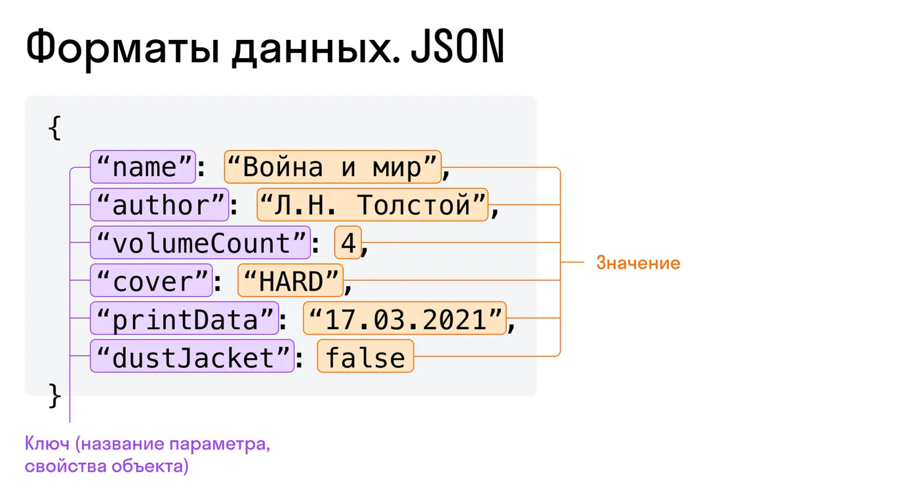

### JSON
JSON (англ. JavaScript Object Notation) — текстовый формат обмена данными. 
В основном им описывают объекты или массивы объектов. 
JSON-объект — это неупорядоченное множество пар «ключ:значение».  
Может использоваться в любом языке программирования. 
Это один из самых популярных форматов передачи данных, так как он достаточно удобочитаем и имеет высокую степень защиты данных.

Особенности JSON:

- файл труднее читать, чем YAML;
- явные, строгие требования к синтаксису;
- нет комментариев;
- строкам нужны двойные кавычки.

Применение: JSON используется в веб-разработке — это лучший формат для сериализации и передачи данных через HTTP-соединение.

Пример файла на JSON
```
{
    "Imaro": {
        "author": "Charles R. Saunders",
        "language": "English",
        "publication-year": "1981",
        "pages": 224
    }
}
```
В качестве значений в JSON могут быть использованы:

- JSON-объект;
- массив;
- число (целое или вещественное);
- литералы *true/false* и null;
- строка.

JSON-объект — это неупорядоченное множество пар «ключ:значение». Ключ — это название параметра, который мы передаем серверу.
<p align="center">
  
</p>

