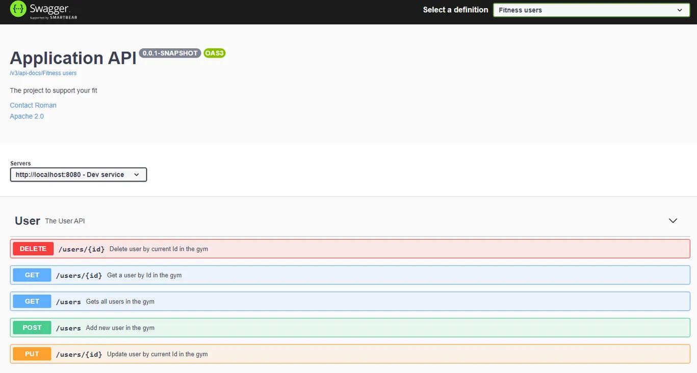
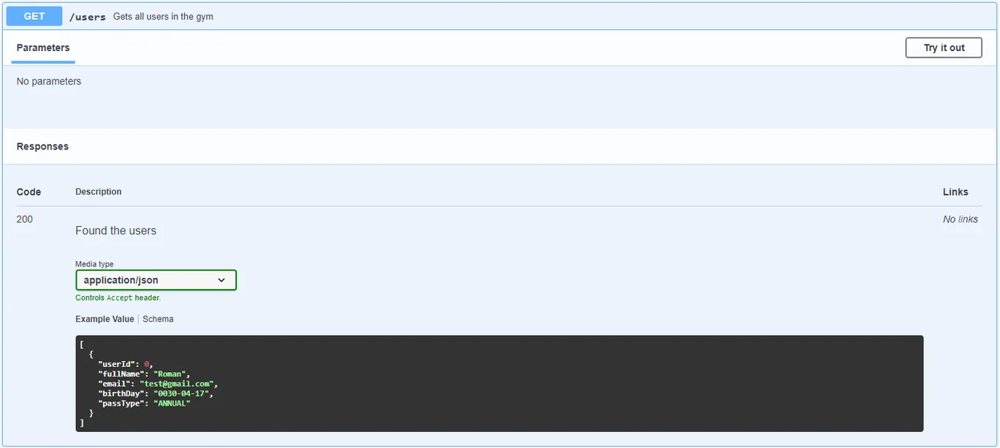

### Swagger

Swagger — это фреймворк для спецификации RESTful API. 
Его прелесть заключается в том, что он дает возможность не только 
интерактивно просматривать спецификацию, но и отправлять 
запросы — так называемый Swagger UI. 
С помощью него вы сможете открыть страницу в браузере со списком 
эндпоинтов (Endpoint) приложения и делать запросы.

Чтобы внедрить его в проект, достаточно добавить зависимость для Maven:
```
<dependency>    
<groupId>org.springdoc</groupId>    
<artifactId>springdoc-openapi-starter-webmvc-ui</artifactId>    
<version>2.6.0</version>
</dependency>
```

Для gradle она будет выглядеть так:  
implementation("org.springdoc:springdoc-openapi-starter-webmvc-ui:2.8.15")

Далее необходимо добавить аннотацию @OpenAPIDefinition к классу с main-методом.
```
@SpringBootApplication
@OpenAPIDefinition
public class CrmApplication {
public static void main(String[] args) { 
SpringApplication.run(CrmApplication.class, args); 
}
}
```
Всё, что вам останется сделать, — это запустить приложение и перейти по ссылке в браузере: http://localhost:8080/swagger-ui.html. И вы попадете на Swagger UI.

### Swagger UI
Swagger UI позволяет визуализировать ресурсы API и взаимодействовать с ними без какой-либо логики реализации. Он автоматически генерируется из вашей спецификации OpenAPI (ранее известной как Swagger), а визуальная документация упрощает внутреннюю реализацию и использование на стороне клиента.

Вот пример Swagger UI, который визуализирует документацию:

<p align="center">
  
</p>

Здесь мы видим, что в приложении есть пять эндпоинтов. Все они имеют разные URL и методы.

Если кликнем по одной из строк, то получим дополнительную информацию. Тут мы видим пример возможного ответа и клавишу «Try it out».
<p align="center">
  
</p>

Если мы нажмем на клавишу «Try it out», то сможем выполнить запрос на сервер и получить ответ от него.

Запросы бывают с параметрами, тогда в интерфейсе появятся поля для ввода данных. В том числе и для ввода данных в тело POST- и PUT-запросов.

Всё просто. Подключаем Swagger, запускаем Swagger UI и делаем запросы к приложению. Так мы можем быстро проверять работоспособность написанного кода.